

# What is Machine Learning?

1. Definition and Overview of Machine Learning.
2. Why use Machine Learning?
3. Types of Machine Learning.
5. Examples of Real-World Applications.

## Definition and Overview of Machine Learning.

Machine Learning is the science of programming computers so they can learn from data.

Traditional programming involves us writing rules, expressed in a programming language, that act on data and give us answers. This applies just about everywhere that something can be programmed with code. Consider a financial services scenario. You have data about a company’s stock, such as its current price and current earnings. You can calculate a valuable ratio called the P/E (for price divided by earnings) with code.

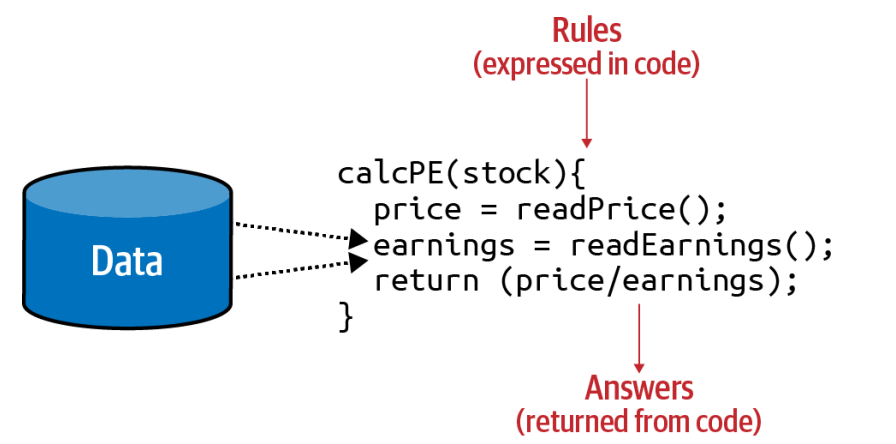

Your code reads the price, reads the earnings, and returns a value that is the former divided by the latter. If I were to try to sum up traditional programming like this into a single diagram, it might look like this.

As you can see, you have rules expressed in a programming language. These rules act on data, and the result is answers.

Traditional programming requires humans to explicitly define all the rules and logic. This makes it difficult for complex or abstract tasks, such as image or speech recognition, where defining every possible rule is impractical or impossible.
Programs operate only as designed, following the exact logic provided by programmers. They don’t adapt to new situations or improve over time without explicit changes to the code.
As the complexity of a problem increases, the number of rules required grows significantly. This impacts scalability, making traditional programming less suitable for tasks that require continuous adaptation and improvement.

These limitations highlight why machine learning is often the preferred approach for complex, data-driven tasks.

We can consider this high-level diagram to define machine learning.

So what are the implications of this? Well, now instead of us trying to figure out what the rules are, we get lots of data about our scenario, we label that data, and the computer can figure out what the rules are that make one piece of data match a particular label and another piece of data match a different label.

## Why Use Machine Learning?

Consider how you would write a spam filter using traditional programming techniques:

1. First you would examine what spam typically looks like. You might notice that some words or phrases (such as “4U,” “credit card,” “free,” and “amazing”) tend to come up a lot in the subject line. Perhaps you would also notice a few other patterns in the sender’s name, the email’s body, and other parts of the email.
2. You would write a detection algorithm for each of the patterns that you noticed, and your program would flag emails as spam if a number of these patterns were detected.
3. You would test your program and repeat steps 1 and 2 until it was good enough to launch.

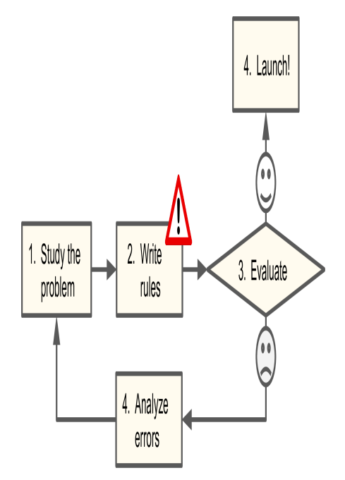

Since the problem is difficult, your program will likely become a long list of complex rules—pretty hard to maintain.

In contrast, a spam filter based on Machine Learning techniques
automatically learns which words and phrases are good predictors of spam by detecting unusually frequent patterns of words in the spam examples compared to the ham examples. The program is much shorter, easier to maintain, and most likely more accurate.

What if spammers notice that all their emails containing “4U” are blocked?
They might start writing “For U” instead. A spam filter using traditional programming techniques would need to be updated to flag “For U” emails. If spammers keep working around your spam filter, you will need to keep writing new rules forever.

In contrast, a spam filter based on Machine Learning techniques
automatically notices that “For U” has become unusually frequent in spam flagged by users, and it starts flagging them without your intervention.

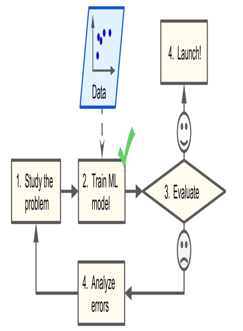

Another area where Machine Learning shines is for problems that either are too complex for traditional approaches or have no known algorithm. For example, consider speech recognition. Say you want to start simple and write a program capable of distinguishing the words “one” and “two.” You might notice that the word “two” starts with a high-pitch sound (“T”), so you could hardcode an algorithm that measures high-pitch sound intensity and use that to distinguish ones and twos—but obviously this technique will not scale to thousands of words spoken by millions of very different people in noisy environments and in dozens of languages. The best solution (at least today) is to write an algorithm that learns by itself, given many example recordings for each word.

To summarize, Machine Learning is great for:

- Problems for which existing solutions require a lot of fine-tuning or long lists of rules: one Machine Learning model can often simplify code and perform better than the traditional approach.
- Complex problems for which using a traditional approach yields no good solution: the best Machine Learning techniques can perhaps find a solution.
- Fluctuating environments: a Machine Learning system can easily be retrained on new data, always keeping it up to date.
- Getting insights about complex problems and large amounts of data.

## Types of Machine Learning

There are so many different types of Machine Learning systems that it is useful to classify them in broad categories, based on the following criteria:

- How they are supervised during training (supervised, unsupervised, semi-supervised, self-supervised, and others).
- Whether or not they can learn incrementally on the fly (online versus batch learning).
- Whether they work by simply comparing new data points to known data points, or instead by detecting patterns in the training data and building a predictive model, much like scientists do (instancebased versus model-based learning).

These criteria are not exclusive; you can combine them in any way you like. For example, a state-of-the-art spam filter may learn on the fly using a deep neural network model trained using human-provided examples of spam and ham; this makes it an online, model-based, supervised learning system.
Let’s look at each of these criteria a bit more closely.

### Training Supervision

ML systems can be classified according to the amount and type of supervision they get during training. There are many categories, but we’ll discuss the main ones: supervised learning, unsupervised learning, self-supervised learning, semi-supervised learning, and Reinforcement Learning.

#### Supervised learning

In _supervised learning_, the training set you feed to the algorithm includes the desired solutions, called _labels_.

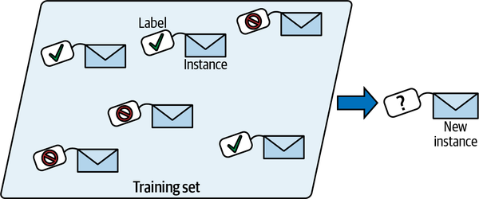

A typical supervised learning task is classification. The spam filter is a good example of this: it is trained with many example emails along with their class (spam or ham), and it must learn how to classify new emails.

Another typical task is to predict a target numeric value, such as the price of a car, given a set of features (mileage, age, brand, etc.). This sort of task is called regression. To train the system, you need to give it many examples of cars, including both their features and their targets (i.e., their prices).

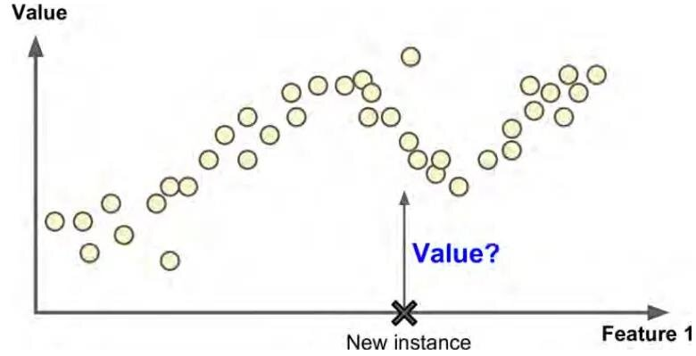

#### Unsupervised learning

In _unsupervised learning_, as you might guess, the training data is unlabeled. The system tries to learn without a teacher.

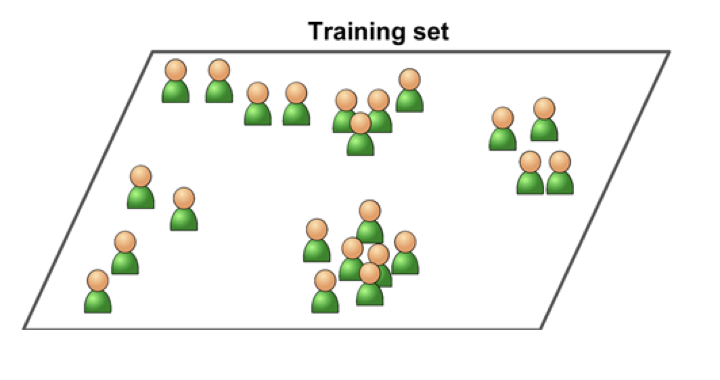

For example, say you have a lot of data about your blog’s visitors. You may want to run a clustering algorithm to try to detect groups of similar visitors. At no point do you tell the algorithm which group a visitor belongs to: it finds those connections without your help. For example, it might notice that 40% of your visitors are teenagers who love comic books and generally read your blog after school, while 20% are adults who enjoy sci-fi and who visit during the weekends. If you use a hierarchical clustering algorithm, it may also subdivide each group into smaller groups.
This may help you target your posts for each group.

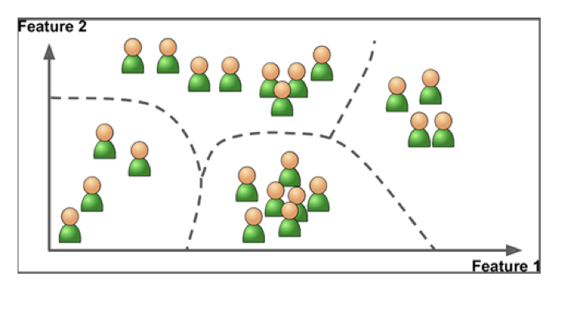

_Visualization algorithms_ are also good examples of unsupervised learning: you feed them a lot of complex and unlabeled data, and they output a 2D or 3D representation of your data that can easily be plotted. These algorithms try to preserve as much structure as they can (e.g., trying to keep separate clusters in the input space from overlapping in the visualization) so that you can understand how the data is organized and perhaps identify unsuspected patterns.

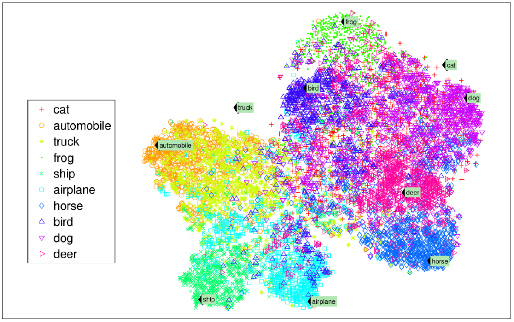

#### Semi-supervised learning

Since labeling data is usually time-consuming and costly, you will often have plenty of unlabeled instances, and few labeled instances. Some algorithms can deal with data that’s partially labeled. This is called _semi-supervised learning_.

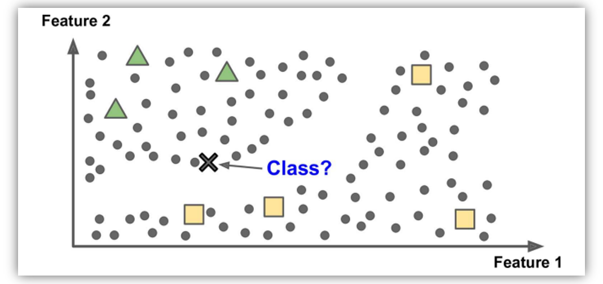

Some photo-hosting services, such as Google Photos, are good examples of this. Once you upload all your family photos to the service, it automatically recognizes that the same person A shows up in photos 1, 5, and 11, while another person B shows up in photos 2, 5, and 7. This is the unsupervised part of the algorithm (clustering). Now all the system needs is for you to tell it who these people are. Just add one label per person and it is able to name everyone in every photo, which is useful for searching photos.

Most semi-supervised learning algorithms are combinations of unsupervised and supervised algorithms. For example a clustering algorithm may be used to group similar instances together, and then every unlabeled instance can be labeled with the most common label in their cluster. Once the whole dataset is labeled, it is possible to use any supervised learning algorithm.

#### Self-supervised learning

Another approach to Machine Learning involves actually generating a fully labeled dataset from a fully unlabeled one. Again, once the whole dataset it labeled, any supervised learning algorithm can be used. This approach is called _self-supervised learning_.

For example, if you have a large dataset of unlabeled images, you can randomly mask a small part of each image and then train a model to recover the original image. During training, the masked images are used as the inputs to the model, and the original images are used as the labels.
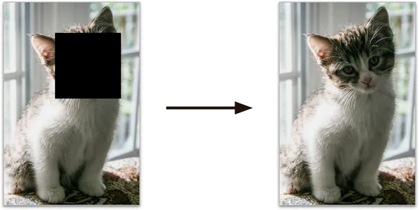

The resulting model may be quite useful in itself, for example to repair damaged images or to erase unwanted objects from pictures. But more often than not, a model trained using self-supervised learning is not the final goal. You usually want to tweak and fine-tune the model for a slightly different task. One that you actually care about.

For example, suppose that what you really want is to have a pet classification model: given a picture of any pet, it will tell you what species it belongs to. If you have a large dataset of unlabeled photos of pets, you can start by training an image-repairing model using self-supervised learning. Once it performs well, it must be able to distinguish different pet species: indeed, when it repairs an image of a cat whose face is masked, it knows it must not add a dog’s face. Assuming your model’s architecture allows it (and most neural network architectures do), it is then possible to tweak the model so that it predicts pet species instead of repairing images. The final step consists of fine-tuning the model on a labeled dataset: the model already knows what cats, dogs and other pet species look like, so this step is only needed so the model can learn the mapping between the species it already knows and the labels we expect from it.

#### Reinforcement Learning
Reinforcement Learning is a very different beast. The learning system, called an agent in this context, can observe the environment, select and perform actions, and get rewards in return (or penalties in the form of negative rewards). It must then learn by itself what is the best strategy, called a policy, to get the most reward over time. A policy defines what action the agent should choose when it is in a given situation.

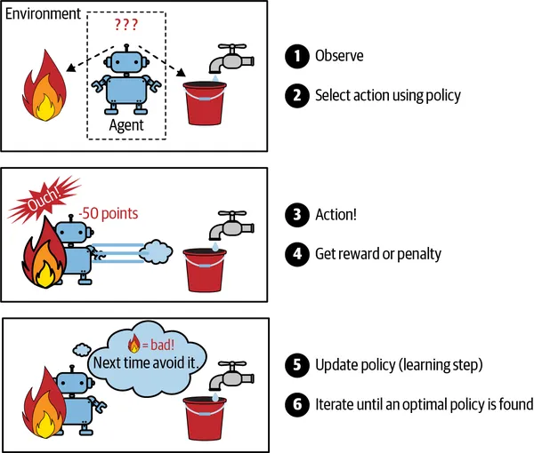

For example, many robots implement Reinforcement Learning algorithms to learn how to walk. DeepMind’s AlphaGo program is also a good example of Reinforcement Learning: it made the headlines in May 2017 when it beat Ke Jie, the number one ranked player in the world at the time, at the game of Go. It learned its winning policy by analyzing millions of games, and then playing many games against itself. Note that learning was turned off during the games against the champion; AlphaGo was just applying the policy it had learned. As we will see in the next section, this is called offline learning.

## Examples of Real-World Applications

Let's look at some concrete examples of Machine Learning tasks, along with the techniques that can tackle them:

**1. Recommendation systems**
Recommendation engines are one of the most popular applications of machine learning, as product recommendations are featured on most e-commerce websites. Using machine learning models, websites track your behavior to recognize patterns in your browsing history, previous purchases, and shopping cart activity. This data collection is used for pattern recognition to predict user preferences.

Companies like Spotify and Netflix use similar machine learning algorithms to recommend music or TV shows based on your previous listening and viewing history. Over time and with training, these algorithms aim to understand your preferences to accurately predict which artists or films you may enjoy.

**2. Social media connections**
Another example of a similar training algorithm is the “people you may know” feature on social media platforms like LinkedIn, Instagram, Facebook, and X (formerly known as Twitter). Based on your contacts, comments, likes, or existing connections, the algorithm suggests familiar faces from your real-life network that you might want to connect with or follow.

**3. Image recognition**
Image recognition is another machine learning technique that appears in our day-to-day life. With the use of ML, programs can identify an object or person in an image based on the intensity of the pixels. This type of facial recognition is used for password protection methods like Face ID and in law enforcement. By filtering through a database of people to identify commonalities and matching them to faces, police officers and investigators can narrow down a list of crime suspects.

**4. Natural language processing (NLP)**
Just like ML can recognize images, language models can also support and manipulate speech signals into commands and text. Software applications coded with AI can convert recorded and live speech into text files.

Voice-based technologies can be used in medical applications, such as helping doctors extract important medical terminology from a conversation with a patient. While this tool isn't advanced enough to make trustworthy clinical decisions, other speech recognition services provide patients with reminders to “take their medication” as if they have a home health aide by their side.

**5. Virtual personal assistants**
Virtual personal assistants are devices you might have in your own homes, such as Amazon’s Alexa, Google Home, or the Apple iPhone’s Siri. These devices use a combination of speech recognition technology and machine learning to capture data on what you're requesting and how often the device is accurate in its delivery. They detect when you start speaking, what you’re saying, and deliver on the command. For example, when you say, “Siri, what is the weather like today?”, Siri searches the web for weather forecasts in your location and provides detailed information.

**6. Stock market predictions**
Predictive analytics and algorithmic trading are common machine learning applications in industries such as finance, real estate, and product development. Machine learning classifies data into groups and then defines them with rules set by data analysts. After classification, analysts can calculate the probability of an action.

These machine learning methods help predict how the stock market will perform based on year-to-year analysis. Using predictive analytics machine learning models, analysts can predict the stock price for 2025 and beyond.

**7. Credit card fraud detection**
Predictive analytics can help determine whether a credit card transaction is fraudulent or legitimate. Fraud examiners use AI and machine learning to monitor variables involved in past fraud events. They use these training examples to measure the likelihood that a specific event was fraudulent activity.

**8. Traffic predictions**
When you use Google Maps to map your commute to work or a new restaurant in town, it provides an estimated time of arrival. Google uses machine learning to build models of how long trips will take based on historical traffic data (gleaned from satellites). It then takes that data based on your current trip and traffic levels to predict the best route according to these factors.

**9. Self-driving car technology**
A frequently used type of machine learning is reinforcement learning, which is used to power self-driving car technology. Self-driving vehicle company Waymo uses machine learning sensors to collect data of the car's surrounding environment in real time. This data helps guide the car's response in different situations, whether it is a human crossing the street, a red light, or another car on the highway.
